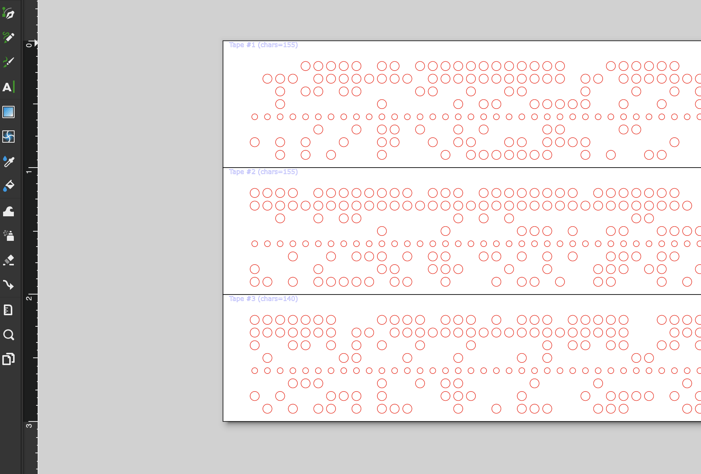
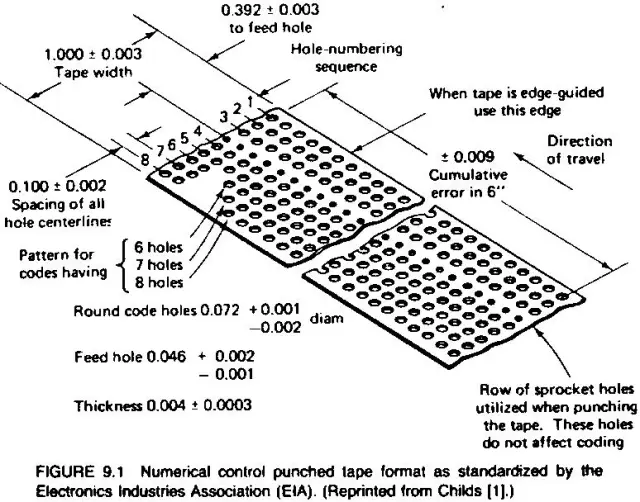

# 8-Bit ASCII to Paper Tape SVG Generator

## Overview
This tool converts ASCII text, including control codes, into an **SVG representation** of a 1-inch-wide 8-bit paper tape. The generated SVG can be used to create paper tapes such as those read by vintage microcomputers, like the **Altair 8800**. 

It supports both regular ASCII characters and control codes, making it suitable for creating authentic paper tape outputs for retro computing enthusiasts.

This tool was made with lasercutting in mind and was created to work with the printbed size of the **Glowforge Pro**. However, the Python code is editable and has clearly defined variables for creating custom tape length(s), margins, and other dimensional alterations. 

Paper tape lengths can be taped together at the margins to make infinitely long paper tape programs.

## Project Demo

Check out this demo of the **8-Bit ASCII to Paper Tape Generator** in action!

[Watch the demo on YouTube](https://www.youtube.com/watch?v=EPgzjeAySPs)


---

## Features
- **8-Bit ASCII Encoding**: Supports standard ASCII and extended control codes.
- **Control Code Parsing**: Input control codes in `<0xNN>` format (e.g., `<0x07>` for the BEL character) to include special ASCII characters.
- **Visual Output**: Generates a detailed SVG file representing the punched holes of the paper tape.
- **ANSI Escape Sequences**: Allows input of escape sequences for terminal control (e.g., `<0x1B>` for ESC).
- **Flexible Input**: Supports regular text, control codes, or a combination of both.
- **Customizable Line Width**: Toggle between 40-column and 80-column widths for text wrapping.
- **Embedded Reference**: Includes a link to an online ASCII table for reference.

---

## Installation
### Prerequisites
- Python 3.x
- The following Python libraries:
  - `tkinter` (pre-installed with Python)
  - `svgwrite`

### Install Dependencies
Run the following commands to install the necessary dependencies:
```bash
pip install svgwrite
```

### Clone the Repository
```bash
git clone https://github.com/colemanjw2/ASCII2PaperTape.git
cd ASCII2PaperTape
```

---

## Usage
1. Run the program:
   ```bash
   python3 ascii2papertape.py
   ```
2. **Input Text**:
   - Enter ASCII text in the main text field.
   - Use `<0xNN>` format for control codes (e.g., `<0x07>` for the BEL character).
   - Mix text and control codes as needed.

3. **Customize Output**:
   - Select the line width (40 or 80 columns).
   - Choose the line endings: `LF` (`\n`) or `CRLF` (`\r\n`).

4. **Generate SVG**:
   - Click the "Generate SVG" button.
   - Save the output file when prompted.

5. **View or Print SVG**:
   - Open the SVG file in your browser or an SVG viewer for inspection.
   - Use it for retro computing projects or printing.

---

## Example Input
### Input Text:
```plaintext
<0x02>HELLO, WORLD!<0x0A>Press any key to continue...<0x07><0x03>
```

### Result:
- `STX` (`<0x02>`) indicates the start of the transmission.
- `BEL` (`<0x07>`) rings the bell.
- `ETX` (`<0x03>`) ends the transmission.
- Regular ASCII characters like `HELLO, WORLD!` are encoded as punched holes.

---

## Example Output
Here’s an example of the generated paper tape SVG. 

Individual tapes get automatically numbered (in blue) for organization.



It complies with this standard:




---

## ASCII Reference
For a full list of ASCII control codes and their meanings, refer to this online table:
[https://www.ascii-code.com/](https://www.ascii-code.com/)

---

## Development Notes
### Key Files:
- `ascii2papertape.py`: Main program file.
- `requirements.txt`: Dependency list for installation.

### Enhancements:
- Add support for new control sequences.
- Optimize SVG generation for complex programs.

---

## License
This project is licensed under the **GNU General Public License v3.0**. Feel free to use, modify, or distribute it for personal or commercial purposes. Just give me a shout out if it helped you. 

---

## Acknowledgments
- ASCII table reference: [ascii-code.com](https://www.ascii-code.com/)
- Inspired by the retro computing era of paper tape.

---
